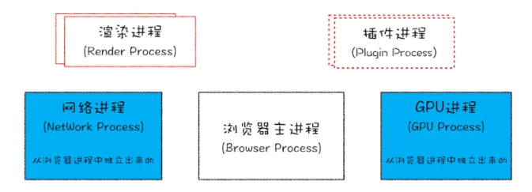

> 在浏览器原理这一篇章，要弄清楚的是
> 1.浏览器**进程与线程**，清楚浏览器是一个什么样的载体？
> 2.清楚在输入URL后浏览器中发生了什么？在这个过程中涉及到**缓存机制**、**渲染流程**、**垃圾回收机制**等？
> 3.了解完整体的内容后，要详细展开每一个模块发送了什么？
> 	1.向服务器请求前要检查是否有缓存？----缓存机制是怎么做的   
> 	2.解析URL时涉及DNS域名解析、TCP与TLS、请求/解析报文、数据传输、网络模型 
> 	3.浏览器拿到返回的内容后，如何进行渲染？
> 	4.页面渲染的过程中，为什么要使用事件循环?
> 	5.浏览器为什么使用同源策略？如何解决跨域问题
> 	6.浏览器的安全如何保证？

## 进程与线程的概念

> 我们要弄清楚一个问题，打开一个标签页，浏览器有哪些进程？线程与进程的关系、线程与进程的区别？

- 1 个浏览器主进程
- 1 个 GPU 进程
- 1 个网络进程
- 多个渲染进程
- 多个插件进程

### 关于浏览器**单线程与多线程**的理解

JavaScript 单线程指的是浏览器中负责解释和执行 JavaScript 代码的只有一个线程，即为**JS引擎线程**，但是浏览器的渲染进程是提供多个线程的，如下：

- JS引擎线程
- 事件触发线程
- 定时触发器线程
- 异步http请求线程
- GUI渲染线程

## 常见面试问题

### 1.进程与线程的区别？
> **整体理解**
> 首先理解进程是资源单位，线程是执行单位;进程包含线程，线程共享进程资源
> 浏览器是多进程（每个标签页一个进程），每个标签页进程内有多个线程（包括 JS 引擎线程）
> JS是单线程（JS 引擎线程只有一个），是为了避免 DOM 渲染冲突；
> JS的异步是靠 “浏览器其他线程 + 事件循环” 实现的，不是真正的 “并行执行”。

- 进程可以看做独立应用，线程不能
- 资源：进程是cpu资源分配的最小单位（是能拥有资源和独立运行的最小单位）；线程是cpu调度的最小单位
- 通信方面：线程间可以通过**直接共享同一进程中的资源**，而进程通信需要**借助进程间通信**。

### 2.为什么设计成单线程？
**为了避免 DOM 渲染冲突。**
JS 可以操作 DOM,而渲染线程负责渲染 DOM。
如果 JS 是多线程，两个线程同时修改 DOM，会导致 DOM 状态混乱（比如一个线程删 DOM，另一个线程改 DOM）；
所以 JS 设计为单线程，且JS 引擎线程和渲染线程是 “互斥” 的：JS 执行时，渲染线程会被挂起（页面卡住）；渲染页面时，JS 代码会暂停执行。

### 3. js是单线程的，是如何解决复杂问题？
JavaScript 单线程指的是浏览器中负责解释和执行 JavaScript 代码的只有一个线程，即为**JS引擎线程**，但是浏览器的渲染进程是提供多个线程的。除此之外JS 单线程通过 事件循环（Event Loop）、异步任务队列、Web Workers 以及 合理的代码设计 解决复杂问题：

**1.事件循环**：将同步任务和异步任务分离，同步任务立即执行，异步任务（如 setTimeout、网络请求）放入任务队列，等待调用栈空时执行，避免阻塞；
**2.微任务与宏任务**：微任务（如 Promise.then）优先级高于宏任务（如 setTimeout），确保高优先级异步任务优先执行；
**3.Web Workers**：将 CPU 密集型任务（如大数据计算）移到后台线程，避免阻塞主线程；
**4.合理拆分任务**：将复杂任务拆分为多个小任务，利用 requestIdleCallback 或 setTimeout 分批执行，避免长时间占用主线程。

